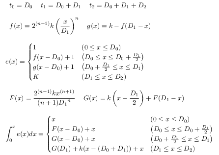
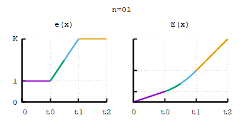
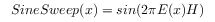
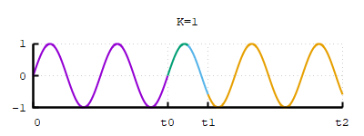
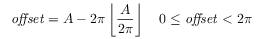
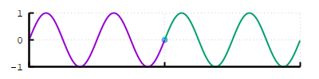
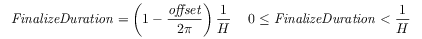
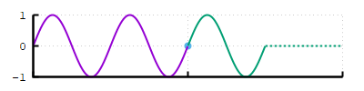

# Sine Wave

Sine wave generation playground. Documented things are work in progress,
and not guaranteed as proper solutions.

## Generating Sine Sweep

|    | Description                     | Unit   |
| -- | ------------------------------- | ------ |
| x  | current time (starts with 0)    | second |
| H  | initial frequency               | hertz  |
| n  | easing factor                   |        |
| K  | frequency multiplier            |        |
| D0 | initial frequency duration      | second |
| D1 | easing duration                 | second |
| D2 | K-fold frequency duration       | second |
| D  | wave duration (= D0 + D1 + D2)  | second |

To change frequency of wave, at first, focus on acceleration of time `e(x)`.
`e(x)` goes from `1`(current freq.) to `K`(K-fold freq.).
And its integral `E(x)` is described as "distored time".

`n` provides easing function as follows:

| n    | easeing function    |
| ---- | ------------------- |
| 1    | linear ease         |
| 2    | quadratic ease      |
| 3    | cubic ease          |
| 4    | biquadratic ease    |
| 5    | quintic ease        |

Finally, formula is defined as follows:

## Appending wave

Partially generated sine wave does not ends with end of cycle
unless its last arguments is integral multiple of `2 * PI`, so must remember
its offset value to append next partial wave,

If `x` is reset zero for each partial wave, in case that the last sine argument `A` is only provided,
offset is described as follows:

Of course, if `fmod` function is avaiable: `offset = fmod(A, 2 * PI)`

## Finalizing wave

As above mentioned, sine wave does not always ends with end of cycle,
so must adjust last partial wave duration by additional duration.
This operation is called "finalize" on this document.

Finalizing algoritm is similar with appending partial wave.
In case that the last sine argument `A` and frequency `H` are provided,
additional duration can be computed as follows:

## License

Authored by Retorillo

No Rights Reserved (CC0)

